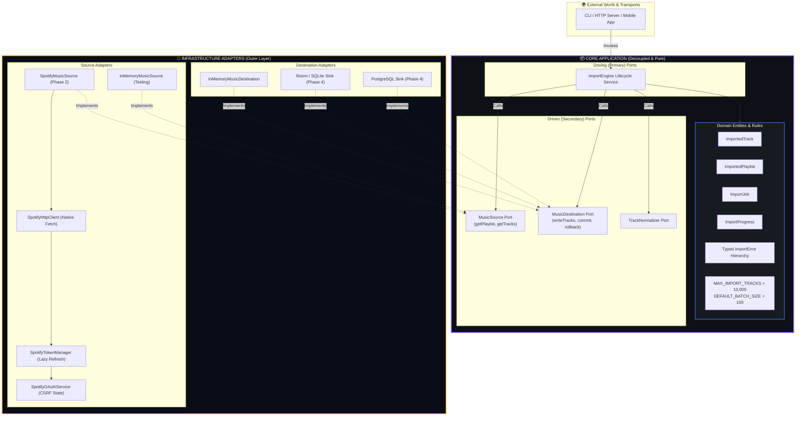
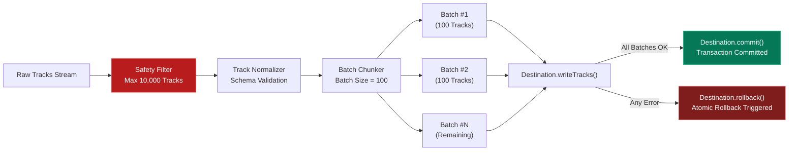

<p align="center">
  
</p>

<h1 align="center">Spoti Import</h1>

<p align="center">
  <strong>Universal Music Import Engine</strong><br/>
  <em>A production-grade, extensible, platform-agnostic music ingestion engine built with strict Hexagonal Architecture (Ports &amp; Adapters) in TypeScript and Node.js LTS.</em>
</p>

<p align="center">
  <a href="#-architecture--deep-dive"></a>
  <a href="#-verification--testing"></a>
  <a href="#-verification--testing"></a>
  <a href="#-security--credentials"></a>
  <a href="#license"></a>
</p>

---

## 🏛️ Deeply Described Architecture

**Spoti Import** is designed around **Ports & Adapters (Hexagonal Architecture)**. The primary objective is absolute isolation between business domain rules and infrastructure technologies.

The core engine operates entirely on universal abstractions (**ports**). Real-world third-party platforms (Spotify, Apple Music, Tidal), persistence engines (Room SQLite, PostgreSQL, Memory), cache layers (Redis, BullMQ), and transport interfaces (HTTP, CLI) reside exclusively on the perimeter as interchangeable **adapters**.

---

### Figure 1: Hexagonal Architecture & Inward Dependency Boundary

The following figure depicts the hexagonal boundary, separating core domain logic from outward-facing secondary adapters:



#### Core Architectural Laws:
1. **The Inward Dependency Rule**: All code dependencies point inward toward the core. Core modules never import from `infrastructure/`.
2. **Protocol Agnosticism**: The core does not know about HTTP status codes, OAuth scopes, Spotify JSON structures, SQLite tables, or Redis queues.
3. **Plug-and-Play Swappability**: Any music source adapter (e.g. Spotify, Apple Music, CSV, local files) can be plugged in without changing a single line of core logic.

---

### Figure 2: The 7-Stage Universal Import Lifecycle Pipeline

The Import Engine coordinates data ingestion through a deterministic 7-stage lifecycle with transactional safety guarantees:

```mermaid
sequenceDiagram
    autonumber
    actor Client as Caller / Client
    participant Engine as ImportEngine
    participant Validator as Zod / Boundary Validator
    participant Source as MusicSource (e.g. Spotify)
    participant Normalizer as TrackNormalizer
    participant Destination as MusicDestination (e.g. Memory / DB)
    participant Progress as Progress Observer

    Client->>Engine: importPlaylist(request)
    activate Engine
    
    rect rgb(26, 32, 44)
    note right of Engine: Stage 1: Request Validation
    Engine->>Validator: Validate playlistId, batchSize & safety ceiling
    alt limit > 10,000
        Engine-->>Client: Return / Throw ImportLimitError
    end
    end

    rect rgb(30, 41, 59)
    note right of Engine: Stage 2: Create ImportJob
    Engine->>Engine: Generate unique UUID & initialize job (status: running)
    Engine->>Progress: Emit initial progress snapshot
    end

    rect rgb(30, 27, 75)
    note right of Engine: Stage 3: Fetch Source Records
    Engine->>Source: getPlaylist(playlistId)
    Source-->>Engine: ImportedPlaylist metadata
    Engine->>Source: getTracks(playlistId, { limit: boundedLimit })
    Source-->>Engine: SourceTrackPage (raw / page items)
    end

    rect rgb(20, 45, 60)
    note right of Engine: Stage 4: Canonical Track Normalization
    loop For each source track item
        Engine->>Normalizer: normalize(rawRecord)
        Normalizer-->>Engine: Validated ImportedTrack domain entity
    end
    end

    rect rgb(45, 20, 50)
    note right of Engine: Stage 5: Batch Processing & Persistence
    Engine->>Engine: Split tracks into chunks of configured batchSize
    alt Playlist is empty (0 tracks)
        Engine->>Destination: commit(jobId)
    else Has tracks
        loop For each batch chunk
            Engine->>Destination: writeTracks(jobId, batchChunk)
            Destination-->>Engine: WriteTracksResult (writtenCount)
            Engine->>Progress: Update writtenTracks, currentBatch, status
        end
        alt All batches successful
            Engine->>Destination: commit(jobId)
        else Batch write failure
            Engine->>Destination: rollback(jobId, cause)
            Engine-->>Client: Fail job & Return / Throw DestinationError
        end
    end
    end

    rect rgb(20, 50, 30)
    note right of Engine: Stage 6 & 7: Progress Update & Finalization
    Engine->>Engine: Mark job completed (completedAt timestamp)
    Engine->>Progress: Emit final completed progress
    Engine-->>Client: ImportResult (success: true, job, progress)
    end
    deactivate Engine
```



---

### Figure 3: Spotify Infrastructure, OAuth & Lazy Token Refresh

The Spotify adapter layer manages authentication, CSRF tokens, Bearer token injection, and automatic expiration refresh without leaking credentials:

```mermaid
sequenceDiagram
    autonumber
    actor User as User / Browser
    participant App as Application / Server
    participant OAuth as SpotifyOAuthService
    participant TokenMgr as SpotifyTokenManager
    participant HTTP as SpotifyHttpClient
    participant Accounts as Spotify Accounts (/api/token)
    participant WebAPI as Spotify Web API (/v1/...)

    rect rgb(35, 25, 45)
    note over User, Accounts: OAuth Authorization Code Flow
    App->>OAuth: createAuthorizationUrl({ state: crypto.randomUUID() })
    OAuth-->>User: Redirect to Spotify Login (with encoded scopes & state)
    User->>Accounts: User approves permissions
    Accounts-->>App: Redirect back with code & state
    App->>OAuth: verifyState(expectedState, receivedState)
    App->>OAuth: exchangeCodeForToken(code)
    OAuth->>Accounts: POST /api/token (Basic Auth, grant: authorization_code)
    Accounts-->>OAuth: 200 OK (access_token, refresh_token, expires_in)
    OAuth-->>App: SpotifyToken model
    end

    rect rgb(20, 35, 55)
    note over TokenMgr, WebAPI: Authenticated API Requests & Lazy Refresh
    App->>TokenMgr: Initialize with SpotifyToken
    App->>HTTP: client.get('/v1/playlists/{id}')
    HTTP->>TokenMgr: getValidAccessToken()
    
    alt Token valid & outside 60s safety window
        TokenMgr-->>HTTP: Return current cached access_token
    else Token expired or inside 60s safety window
        TokenMgr->>OAuth: refreshAccessToken(refreshToken)
        OAuth->>Accounts: POST /api/token (grant: refresh_token)
        Accounts-->>OAuth: New access_token
        OAuth-->>TokenMgr: Refreshed SpotifyToken
        TokenMgr-->>HTTP: Return freshly minted access_token
    end

    HTTP->>WebAPI: GET /v1/playlists/{id} [Authorization: Bearer <token>]
    
    alt 200 OK
        WebAPI-->>HTTP: JSON payload
        HTTP-->>App: Parsed response
    else 429 Rate Limit
        WebAPI-->>HTTP: 429 Too Many Requests (Retry-After header)
        HTTP-->>App: Throw SpotifyApiError (retryable: true, retryAfterSeconds)
    else 401 / 403 Error
        WebAPI-->>HTTP: 401 / 403 Forbidden
        HTTP-->>App: Throw SpotifyApiError (retryable: false, secrets scrubbed)
    end
    end
```



---

### Figure 4: Data Normalization Schema Mapping

Spotify API responses are normalized into standard, portable `ImportedTrack` domain entities. Optional or missing fields are handled safely:

```
[ Raw Spotify Track Payload ]                 [ Canonical ImportedTrack Domain Model ]
┌───────────────────────────────────────┐     ┌──────────────────────────────────────────────┐
│ id: "11dFghVXANMlKmJXsNCbNl"          │ ──▶ │ source: "spotify"                            │
│ name: "Stay"                          │ ──▶ │ sourceId: "11dFghVXANMlKmJXsNCbNl"           │
│ duration_ms: 141806                   │ ──▶ │ title: "Stay"                                │
│ explicit: true                        │ ──▶ │ artists: [                                   │
│ track_number: 1                       │ │   │   { name: "The Kid LAROI", sourceId: "..." } │
│ disc_number: 1                        │ │   │   { name: "Justin Bieber", sourceId: "..." } │
│ external_ids: { isrc: "USSM12104193" }│ │   │ ]                                            │
│ popularity: 88                        │ │   │ album: {                                     │
│ uri: "spotify:track:..."              │ │   │   title: "F*CK LOVE 3+: OVER YOU",           │
│ artists: [                            │ │   │   sourceId: "4Gfnly5CzMJQqkUWFOHaP3",        │
│   { id: "2tIP...", name: "The Kid.." }│ │   │   releaseDate: "2021-07-23",                 │
│   { id: "1uNF...", name: "Justin.." } │ │   │   totalTracks: 35,                           │
│ ]                                     │ │   │   artwork: "https://i.scdn.co/stay-art.jpg"  │
│ album: {                              │ │   │ }                                            │
│   name: "F*CK LOVE 3+: OVER YOU",     │ │   │ albumArtist: "The Kid LAROI"                 │
│   images: [{ url: "https://..." }]    │ │   │ durationMs: 141806                           │
│ }                                     │ │   │ isrc: "USSM12104193"                         │
│ (null items / deleted tracks)         │ │   │ trackNumber: 1                               │
│  └── Automatically filtered out       │ │   │ discNumber: 1                                │
└───────────────────────────────────────┘     │ explicit: true                               │
                                              │ artwork: "https://i.scdn.co/stay-art.jpg"    │
                                              │ metadata: { uri, popularity, isPlayable }    │
                                              └──────────────────────────────────────────────┘
```

---

### Figure 5: Transactional Safety & Batching Mechanics



---

## 📁 Directory Structure

```
src/
├── core/
│   ├── domain/                         # Pure domain entities, Zod schemas, constants, errors
│   │   ├── constants.ts                # MAX_IMPORT_TRACKS (10,000) & DEFAULT_BATCH_SIZE (100)
│   │   ├── errors.ts                   # Structured, machine-readable ImportError hierarchy
│   │   ├── models.ts                   # ImportedTrack, ImportedAlbum, ImportedArtist, etc.
│   │   └── index.ts
│   ├── ports/                          # Generic port interfaces
│   │   ├── music-source.ts             # MusicSource interface (getPlaylist, getTracks)
│   │   ├── music-destination.ts        # MusicDestination interface (writeTracks, commit, rollback)
│   │   ├── track-normalizer.ts         # TrackNormalizer interface
│   │   └── index.ts
│   └── services/                       # Core orchestration services
│       ├── default-track-normalizer.ts # Zod-based normalization service
│       ├── import-engine.ts            # ImportEngine 7-stage lifecycle service
│       └── index.ts
├── infrastructure/                     # Outer adapter implementations
│   ├── memory/                         # In-memory reference adapters
│   │   ├── in-memory-music-source.ts
│   │   └── in-memory-music-destination.ts
│   ├── spotify/                        # Spotify Infrastructure Adapter (Phase 2)
│   │   ├── auth/                       # Spotify OAuth & Token management
│   │   │   ├── spotify-config.ts       # Typed config & env validation
│   │   │   ├── spotify-token.ts        # Token model & safety window expiration
│   │   │   └── spotify-oauth.ts        # Authorization code flow & CSRF state verification
│   │   ├── client/                     # Authenticated HTTP client
│   │   │   ├── spotify-errors.ts       # Typed API errors with scrubbed secrets
│   │   │   ├── spotify-token-manager.ts# Lazy expiration token provider
│   │   │   └── spotify-http-client.ts  # Native fetch client with Bearer auth & retry hints
│   │   ├── models/                     # Internal Spotify API response schemas
│   │   ├── spotify-music-source.ts     # Adapter implementing MusicSource port
│   │   └── index.ts
│   └── index.ts
└── index.ts                            # Stable public API gateway

tests/
├── core/                               # Core domain & service unit tests
│   ├── import-engine.test.ts           # Full 7-stage engine lifecycle tests
│   ├── domain-validation.test.ts       # Domain entity & boundary validation
│   └── in-memory-adapters.test.ts      # In-memory adapter test suite
└── infrastructure/                     # Infrastructure adapter unit tests
    └── spotify/
        ├── spotify-config.test.ts      # Config parser & env validation
        ├── spotify-oauth.test.ts       # OAuth, CSRF state & token expiration
        ├── spotify-http-client.test.ts # Bearer auth, 401/403/429/5xx, auto-refresh
        └── spotify-music-source.test.ts# Normalization & engine integration
```

---

## 🚀 Getting Started

### Prerequisites
- **Node.js LTS** (v20+ or v24+)
- **npm** (v10+)

### Installation

```bash
npm install
```

### Type Checking

```bash
npm run typecheck
```

### Running Tests

```bash
npm test
```

### Production Build

```bash
npm run build
```

---

## 🎧 Spotify Setup Guide (Phase 2)

The Spotify integration provides an authenticated source adapter satisfying the generic `MusicSource` port.

> [!IMPORTANT]
> Real credentials must **NEVER** be committed to the repository or stored in source code. Credentials belong strictly in environment variables.

### 1. Create a Spotify Developer Application
1. Log in to the [Spotify Developer Dashboard](https://developer.spotify.com/dashboard).
2. Create a new app and note your **Client ID** and **Client Secret**.

### 2. Configure Redirect URI
1. In your app settings on the Spotify Developer Dashboard, navigate to **Redirect URIs**.
2. Add your application callback URI (e.g., `http://localhost:3000/callback`).

### 3. Copy Environment Template
Copy the example file to a local `.env` file (which is git-ignored):

```bash
cp .env.example .env
```

### 4. Fill Credentials Locally
Open `.env` and fill in your credentials:

```env
SPOTIFY_CLIENT_ID=your_spotify_client_id_here
SPOTIFY_CLIENT_SECRET=your_spotify_client_secret_here
SPOTIFY_REDIRECT_URI=http://localhost:3000/callback
```

### 5. Start the OAuth Flow
Generate a cryptographically secure CSRF `state` and create the authorization URL using the minimal required scopes (`playlist-read-private`, `playlist-read-collaborative`):

```typescript
import {
  loadSpotifyConfigFromEnv,
  SpotifyOAuthService,
} from 'universal-music-import-engine';

const config = loadSpotifyConfigFromEnv();
const oauthService = new SpotifyOAuthService({ config });

// Caller generates and stores state in session/cookie for CSRF validation
const state = crypto.randomUUID();
const authUrl = oauthService.createAuthorizationUrl({ state });
// Redirect user to authUrl
```

### 6. Handle the Callback & Verify State
When Spotify redirects to your callback URL with `code` and `state`:

```typescript
// Verify that the returned state matches the stored state
oauthService.verifyState(expectedState, receivedState);
```

### 7. Exchange Authorization Code for Tokens
Exchange the one-time code for a token pair (`accessToken` and `refreshToken`):

```typescript
import {
  SpotifyTokenManager,
  SpotifyHttpClient,
  SpotifyMusicSource,
  ImportEngine,
  InMemoryMusicDestination,
} from 'universal-music-import-engine';

const token = await oauthService.exchangeCodeForToken(code);

// Pass token to SpotifyTokenManager and SpotifyHttpClient
const tokenManager = new SpotifyTokenManager({
  initialToken: token,
  oauthService,
});

const client = new SpotifyHttpClient({ tokenProvider: tokenManager });
const spotifySource = new SpotifyMusicSource(client);

// Plug directly into the Universal ImportEngine
const engine = new ImportEngine({
  source: spotifySource,
  destination: new InMemoryMusicDestination(),
});

const result = await engine.importPlaylist({ playlistId: '37i9dQZF1DXcBWIGoYBM5M' });
console.log('Import success:', result.success, 'Tracks:', result.progress.writtenTracks);
```

---

## 🛡️ Security & Zero-Leakage Policy

- **No Secrets in Logs or Exceptions**: Access tokens and client secrets are never printed in logs or included in `SpotifyApiError` or `SpotifyAuthError` messages.
- **CSRF Protection**: All OAuth authorization requests mandate a caller-verified `state` token.
- **Deterministic Test Suite**: All 48 unit tests run against deterministic mock handlers—no live network requests are executed during tests.
- **Strict Git Boundaries**: Real `.env` files are ignored by git; only `.env.example` with harmless placeholders is committed.

---

## 🚧 Phase Boundaries & What is Deferred

In accordance with Phase 2 boundaries, the following capabilities are explicitly reserved for subsequent phases:

- ❌ **Phase 3**: Real playlist pagination loops & 10,000-track streaming ingestion.
- ❌ **Phase 4**: Persistent storage sinks (Room SQLite, PostgreSQL, Filesystem).
- ❌ **Phase 5**: Asynchronous background job queues (Redis, BullMQ).
- ❌ **Phase 6**: Transport layers (CLI commands, REST API endpoints, Webhooks).
- ❌ **Out of Scope**: Audio stream scraping, YouTube / Apple Music integration, DRM tampering.

---

## 📜 License

This project is licensed under the [MIT License](LICENSE).
